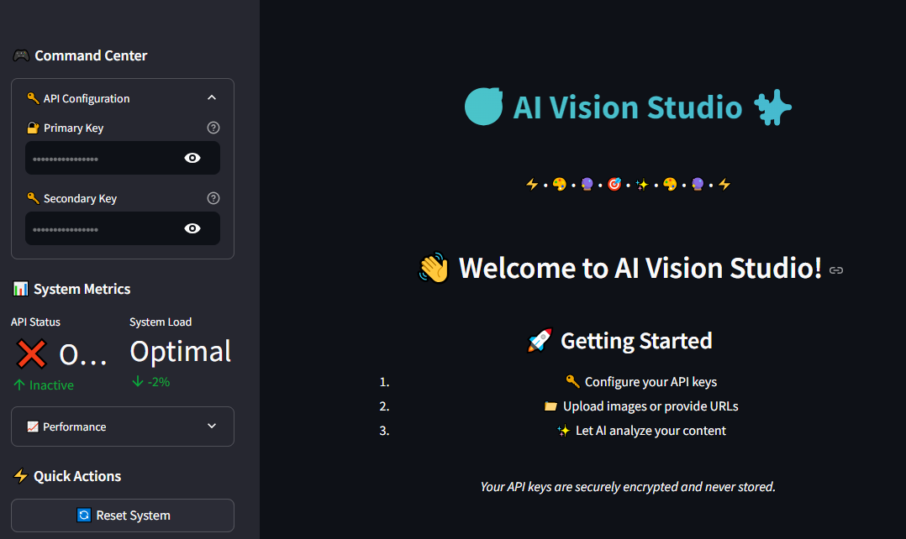

# 🎯 AI Vision Studio 

[](https://www.python.org/downloads/)
[](https://streamlit.io)
[](https://cloud.google.com/vertex-ai/docs/generative-ai/model-reference/gemini)
[](https://opensource.org/licenses/Apache-2.0)

A powerful, modern web application for advanced image analysis and batch processing using Google's Gemini API and Streamlit. Features a beautiful, intuitive interface with real-time processing capabilities and comprehensive reporting options.



## ✨ Features

- 🖼️ **Single Image Analysis**
  - Upload images directly or via URL
  - Real-time image preview
  - Customizable analysis depth and focus areas
  - Comprehensive analysis results

- 📊 **Batch Processing**
  - Excel file support for bulk URL processing
  - Progress tracking
  - Automated results export
  - Error handling and reporting

- 🎨 **Modern UI/UX**
  - Animated gradient headers
  - Intuitive navigation
  - Real-time system metrics
  - Progress indicators and celebrations

- 🔒 **Security**
  - Secure API key management
  - No data storage
  - Encrypted communications

## 🚀 Quick Start

### Prerequisites

```bash
python >= 3.8
streamlit >= 1.28
pandas
pillow
openpyxl
```

### Installation

1. Clone the repository:
```bash
git clone https://github.com/Decepticon-TS/Cap-AI-Studio.git
cd Cap-AI-Studio
```

2. Install dependencies:
```bash
pip install -r requirements.txt
```

3. Set up your Gemini API keys:
   - Get your API keys from [Google Cloud Console](https://console.cloud.google.com)
   - Add them to the application via the UI or environment variables

4. Run the application:
```bash
streamlit run app.py
```

## 📁 Project Structure

```
Cap-AI-Studio/
├── app.py                  # Main application file
├── requirements.txt        # Python dependencies
├── LICENSE                 # MIT License
├── README.md              # This file
├── assets/                # Images and static files
│   └── demo_screenshot.png
├── src/
│   ├── __init__.py
│   ├── processing_time.py    # Estimated time processing system
│   ├── image_captioning.py    # Image captioning system
│   ├── img_pro.py            # Image processing utilities
│   ├── excel_processor.py    # Excel handling
│   └── session_manager.py    # Session management
└── tests/
    ├── __init__.py
    ├── test_image_captioning.py
    ├── test_img_pro.py
    └── test_excel_processor.py
```

## 🖥️ Usage

### Single Image Analysis

1. Launch the application
2. Enter your Gemini API keys in the sidebar
3. Choose between file upload or URL input
4. Configure analysis settings
5. Click "Analyze Image"
6. View and export results

### Batch Processing

1. Prepare an Excel file with columns:
   - `content_id`: Unique identifier for each image
   - `URL`: Direct link to the image
2. Upload the Excel file
3. Review the preview
4. Click "Process All URLs"
5. Download the results

## 🎨 Customization

### Styling

Modify the header animation:
```python
# In app.py
def create_animated_header(text, animation_duration=2):
    # Customize colors, timing, and effects
    return f"""
        <div style='
            background: linear-gradient(45deg, #YOUR_COLORS_HERE);
            ...
        '>
    """
```

### Analysis Settings

Adjust processing options in `src/image_captioning.py`:
```python
class ImageCaptioningSystem:
    def __init__(self):
        self.analysis_levels = {
            "Basic": {"depth": 1, "features": ["objects", "colors"]},
            "Expert": {"depth": 5, "features": ["objects", "colors", "text", "emotions", "activities"]}
        }
```

## 🤝 Contributing

1. Fork the repository
2. Create your feature branch (`git checkout -b feature/AmazingFeature`)
3. Commit your changes (`git commit -m 'Add some AmazingFeature'`)
4. Push to the branch (`git push origin feature/AmazingFeature`)
5. Open a Pull Request

## 👥 Authors

- [@Decepticon-TS](https://github.com/Decepticon-TS)
- [@XenosWarlocks](https://github.com/XenosWarlocks)

## 🙏 Acknowledgments

- Google Gemini API for powerful image analysis
- Streamlit for the amazing web framework
- Contributors and the open-source community


Project Link: [https://github.com/Decepticon-TS/Cap-AI-Studio](https://github.com/Decepticon-TS/Cap-AI-Studio)
